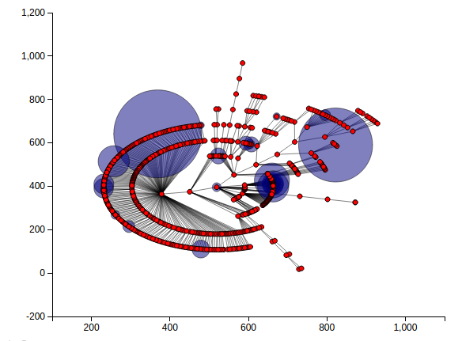
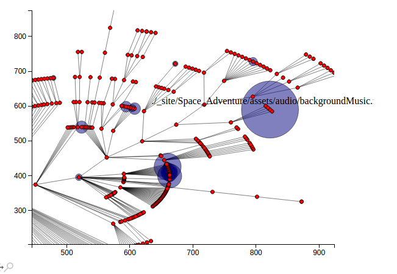

# mapOutDirectory

Script for drawing out a graph resembling the directory structure  to get sense of file size distribution.

Run in directory you want to map out as `python path/to/script/mapout.py`.

Generates the following in a browser window:   

Then you can zoom into and mouse over nodes representing files and folders to get their names. Blue circles represent the proportionate file sizes:   

